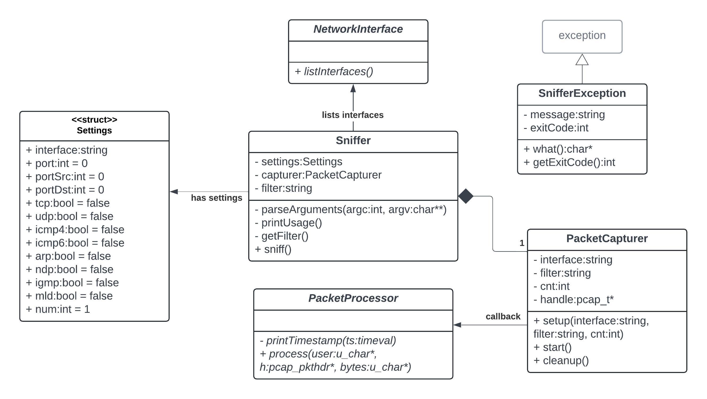

# IPK Project 2: ZETA: Network sniffer
Author: Adam Valík (xvalik05) @ FIT VUT 2024  
License: GPLv3.0 License. See the [LICENSE](LICENSE) file for details.

This project represents a network sniffer implementation written in C++ (standard C++20), specified [here](https://git.fit.vutbr.cz/NESFIT/IPK-Projects-2024/src/branch/master/Project%202/zeta).

## Table of Contents
- [Usage](#usage)
- [`Sniffer`](#sniffer)
- [`PacketCapturer`](#packetcapturer)
- [`PacketProcessor`](#packetprocessor)
  - [Output format](#output-format)
- [`SnifferException`](#snifferexception)
- [UML Class Diagram](#uml-class-diagram)
- [Interrupt signal](#interrupt-signal)
- [Testing](#testing)
    - [List active interfaces](#list-active-interfaces)
    - [TCP packets](#tcp-packets)
    - [UDP packets](#udp-packets)
    - [IGMP packets](#igmp-packets)
    - [ARP packets](#arp-packets)
- [Code documentation](#code-documentation)
- [Bibliography](#bibliography)


## Usage
The project is built by running `make`, consolidating it into a single binary executable file named `ipk-sniffer`.
```
Usage:
./ipk-sniffer [-i|--interface interface] [-p|--port-source|--port-destination port] [-t|--tcp] [-u|--udp] [--arp] [--ndp] [--icmp4] [--icmp6] [--igmp] [--mld] [-n num]
```

| Argument | Value |  Meaning or Expected Behavior  |
|---|---|---|
| `-i \| --interface` | string | interface to sniff |
| `-p` | 0-65535 | source or destination port |
| `--port-source` | 0-65535 | source port |
| `--port-destination` | 0-65535 | destination port |
| `-t \|--tcp` | | sniff TCP segments |
| `-u \|--udp` | | sniff UDP datagrams |
| `--icmp4` | | sniff ICMPv4 packets |
| `--icmp6` | | sniff ICMPv6 echo requst/response |
| `--arp` | | sniff ARP frames |
| `--ndp` | | sniff NDP packets |
| `--igmp` | | sniff IGMP packets |
| `--mld` | | sniff MLD packets |
| `-n` | integer | number of packets to print |
| `-h \| --help` | | display usage |

> If the number of packets is not specified, only one packet is printed.  
> If the interface parameter is not specified, a list of active interfaces is displayed.  
> Unless protocols are explicitly specified, all are considered for printing.

## `Sniffer`
The `Sniffer` class is the main class of the application. It is responsible for parsing command-line arguments, filling `Settings` structure with provided informations, printing help message or calling `NetworkInterface::listActiveInterfaces()` if the interface is not specified. Based on the given arguments it then creates a filter expression and sets up the `PacketCapturer` to start capturing packets.

## `PacketCapturer`
Packet capturing initialization contains calls of functions from library `<pcap/pcap.h>` to find the netmask (`pcap_lookupnet()`), open the device in promiscuous mode (`pcap_open_live()`), filter only ethernet frames (`pcap_datalink()`), compile the filter expression (`pcap_compile()`), set the filter (`pcap_setfilter()`) and start capturing packets (`pcap_loop()`). The `PacketProcessor::process()` is called for each captured packet.

## `PacketProcessor`
The callback routine is encapsulated in static method `PacketProcessor::process()`. It contains the logic for processing the packet, extracting the header information and printing it to the standard output. 

### Output format
`timestamp:`  timestamp in RFC3339 format: YYYY-MM-DDTHH:MM:SS.sss±HH:MM  
`src MAC:`  MAC address in format XX:XX:XX:XX:XX:XX  
`dst MAC:`  MAC address in format XX:XX:XX:XX:XX:XX  
MAC addresses uniquely identify network interfaces at the Data Link Layer. These are crucial for directing traffic on the same local network.  

`frame length:`  length of the frame in bytes  
`src IP:`  source IP address in format X.X.X.X  
`dst IP:`  destination IP address in format X.X.X.X  
IP addresses identify devices at the Network Layer and are essential for routing packets across different networks.

For TCP and UDP packets:  
`src port:`  source port number  
`dst port:`  destination port number  
Ports are used by the Transport Layer to direct traffic to specific services or applications running on a device.

For ICMPv4, ICMPv6 and IGMP packets:  
`type:`  type of the packet  
`code:`  code of the packet  

Payload in format:  
`byte_offset: byte_offset_hexa  byte_offset_ASCII`

Non-printable characters are replaced with a period.

## `SnifferException`
Custom expression extending `std::exception` is implemented to end the program with a specific error message and code anywhere during the program execution. It is catched and handled in the `main()` function.

## UML Class Diagram


Classes containing only static methods considered abstract are in italic. For clarity, relationships between the exception and the remaining classes are omitted.

## Interrupt signal
Interrupt signals (e.g., Ctrl+C) are handled gracefully throughout the program, allowing for a controlled termination.

## Testing
Wireshark, a network protocol analyzer, was used to validate the output. This involved capturing network traffic and analyzing the details of each packet by comparing the data captured by Wireshark with the sniffer's logs.

> Note: The program should have been tested on reference platform, but I was unable to run it on my machine. Thus the following examples are based on the output of the program running on macOS. The output may vary on different operating systems. 

### List active interfaces
If the `-i|--interface` option is used without specifying an interface or not used at all, the program will list all active interfaces on the system.
```
./ipk-sniffer -i
en0
awdl0
llw0
utun0
utun1
utun2
utun3
utun5
utun6
lo0
anpi0
anpi1
en3
en4
en1
en2
bridge0
gif0
stf0
ap1
```
It can be validated by running `ifconfig` in the terminal.
```
ifconfig -l
lo0 gif0 stf0 anpi0 anpi1 en3 en4 en1 en2 ap1 en0 awdl0 llw0 bridge0 utun0 utun1 utun2 utun3 utun5 utun6
```

### TCP packets
TCP (Transmission Control Protocol) packets are used for establishing and maintaining connections between devices. 
```
./ipk-sniffer -i en0 -t 

timestamp: 2024-04-22T21:18:04.261+02:00
src MAC: 54:67:51:c1:dd:8d
dst MAC: d4:57:63:cd:30:75
frame length: 237 bytes
src IP: 162.159.136.234
dst IP: 192.168.0.234
src port: 443
dst port: 56034

0x0000: d4 57 63 cd 30 75 54 67 51 c1 dd 8d 08 00 45 00   .Wc.0uTg Q.....E.
0x0010: 00 df a2 aa 40 00 3b 06 af 52 a2 9f 88 ea c0 a8   ....@.;. .R......
0x0020: 00 ea 01 bb da e2 60 0b 1d ec ad b7 82 e9 80 18   ......`. ........
0x0030: 00 08 60 42 00 00 01 01 08 0a 44 87 9d 4c eb 8e   ..`B.... ..D..L..
0x0040: bc 6b 17 03 03 00 a6 ca d0 d1 fd 77 02 11 f4 84   .k...... ...w....
0x0050: f5 b8 71 dd 9b b4 08 b7 f3 e2 15 a0 7c 04 17 fe   ..q..... ....|...
0x0060: b1 d3 8e b1 f7 46 b0 c7 22 d5 48 6b c9 2f 42 3c   .....F.. ".Hk./B<
0x0070: 50 f0 f9 89 9a 45 d6 2c 0e f9 69 e2 21 63 ad 98   P....E., ..i.!c..
0x0080: 1e cc 9c 85 f1 4a 54 21 7e 78 ff eb db 06 4f 08   .....JT! ~x....O.
0x0090: 23 85 29 56 5c f9 0d 02 e0 4a 59 5d e2 2c f7 d2   #.)V\... .JY].,..
0x00a0: f0 e5 de 02 e0 b0 d9 88 19 0b 2b 46 7d 7c 43 e3   ........ ..+F}|C.
0x00b0: 43 af 12 b2 0d 91 5c 05 fc 48 5d e8 02 52 d9 98   C.....\. .H]..R..
0x00c0: a7 91 f0 46 1b b0 ab 05 76 ba 8c 4a 5f f5 ca f4   ...F.... v..J_...
0x00d0: 87 07 87 c2 59 e8 c0 b5 66 7b f6 1e e6 54 e3 c9   ....Y... f{...T..
0x00e0: 33 6e 16 8f a4 dd 42 61 b3 80 95 71 33            3n....Ba ...q3
```
Compared to the Wireshark output:
```
162.159.136.234	192.168.0.234	TLSv1.2	237	Application Data

0000   d4 57 63 cd 30 75 54 67 51 c1 dd 8d 08 00 45 00   .Wc.0uTgQ.....E.
0010   00 df a2 aa 40 00 3b 06 af 52 a2 9f 88 ea c0 a8   ....@.;..R......
0020   00 ea 01 bb da e2 60 0b 1d ec ad b7 82 e9 80 18   ......`.........
0030   00 08 60 42 00 00 01 01 08 0a 44 87 9d 4c eb 8e   ..`B......D..L..
0040   bc 6b 17 03 03 00 a6 ca d0 d1 fd 77 02 11 f4 84   .k.........w....
0050   f5 b8 71 dd 9b b4 08 b7 f3 e2 15 a0 7c 04 17 fe   ..q.........|...
0060   b1 d3 8e b1 f7 46 b0 c7 22 d5 48 6b c9 2f 42 3c   .....F..".Hk./B<
0070   50 f0 f9 89 9a 45 d6 2c 0e f9 69 e2 21 63 ad 98   P....E.,..i.!c..
0080   1e cc 9c 85 f1 4a 54 21 7e 78 ff eb db 06 4f 08   .....JT!~x....O.
0090   23 85 29 56 5c f9 0d 02 e0 4a 59 5d e2 2c f7 d2   #.)V\....JY].,..
00a0   f0 e5 de 02 e0 b0 d9 88 19 0b 2b 46 7d 7c 43 e3   ..........+F}|C.
00b0   43 af 12 b2 0d 91 5c 05 fc 48 5d e8 02 52 d9 98   C.....\..H]..R..
00c0   a7 91 f0 46 1b b0 ab 05 76 ba 8c 4a 5f f5 ca f4   ...F....v..J_...
00d0   87 07 87 c2 59 e8 c0 b5 66 7b f6 1e e6 54 e3 c9   ....Y...f{...T..
00e0   33 6e 16 8f a4 dd 42 61 b3 80 95 71 33            3n....Ba...q3
```

### UDP packets
UDP (User Datagram Protocol) packets are used for sending data between devices without establishing a connection.
```
./ipk-sniffer -i en0 -u

timestamp: 2024-04-22T21:22:59.656+02:00
src MAC: 28:d0:ea:64:e6:55
dst MAC: 01:00:5e:7f:ff:fa
frame length: 217 bytes
src IP: 192.168.0.242
dst IP: 239.255.255.250
src port: 61881
dst port: 1900

0x0000: 01 00 5e 7f ff fa 28 d0 ea 64 e6 55 08 00 45 00   ..^...(. .d.U..E.
0x0010: 00 cb f0 d2 00 00 01 11 16 bb c0 a8 00 f2 ef ff   ........ ........
0x0020: ff fa f1 b9 07 6c 00 b7 ed 54 4d 2d 53 45 41 52   .....l.. .TM-SEAR
0x0030: 43 48 20 2a 20 48 54 54 50 2f 31 2e 31 0d 0a 48   CH * HTT P/1.1..H
0x0040: 4f 53 54 3a 20 32 33 39 2e 32 35 35 2e 32 35 35   OST: 239 .255.255
0x0050: 2e 32 35 30 3a 31 39 30 30 0d 0a 4d 41 4e 3a 20   .250:190 0..MAN: 
0x0060: 22 73 73 64 70 3a 64 69 73 63 6f 76 65 72 22 0d   "ssdp:di scover".
0x0070: 0a 4d 58 3a 20 31 0d 0a 53 54 3a 20 75 72 6e 3a   .MX: 1.. ST: urn:
0x0080: 64 69 61 6c 2d 6d 75 6c 74 69 73 63 72 65 65 6e   dial-mul tiscreen
0x0090: 2d 6f 72 67 3a 73 65 72 76 69 63 65 3a 64 69 61   -org:ser vice:dia
0x00a0: 6c 3a 31 0d 0a 55 53 45 52 2d 41 47 45 4e 54 3a   l:1..USE R-AGENT:
0x00b0: 20 47 6f 6f 67 6c 65 20 43 68 72 6f 6d 65 2f 31    Google  Chrome/1
0x00c0: 32 33 2e 30 2e 36 33 31 32 2e 31 32 32 20 57 69   23.0.631 2.122 Wi
0x00d0: 6e 64 6f 77 73 0d 0a 0d 0a                        ndows... .
```
Compared to the Wireshark output:
```
192.168.0.242	239.255.255.250	SSDP	217	M-SEARCH * HTTP/1.1 

0000   01 00 5e 7f ff fa 28 d0 ea 64 e6 55 08 00 45 00   ..^...(..d.U..E.
0010   00 cb f0 d2 00 00 01 11 16 bb c0 a8 00 f2 ef ff   ................
0020   ff fa f1 b9 07 6c 00 b7 ed 54 4d 2d 53 45 41 52   .....l...TM-SEAR
0030   43 48 20 2a 20 48 54 54 50 2f 31 2e 31 0d 0a 48   CH * HTTP/1.1..H
0040   4f 53 54 3a 20 32 33 39 2e 32 35 35 2e 32 35 35   OST: 239.255.255
0050   2e 32 35 30 3a 31 39 30 30 0d 0a 4d 41 4e 3a 20   .250:1900..MAN: 
0060   22 73 73 64 70 3a 64 69 73 63 6f 76 65 72 22 0d   "ssdp:discover".
0070   0a 4d 58 3a 20 31 0d 0a 53 54 3a 20 75 72 6e 3a   .MX: 1..ST: urn:
0080   64 69 61 6c 2d 6d 75 6c 74 69 73 63 72 65 65 6e   dial-multiscreen
0090   2d 6f 72 67 3a 73 65 72 76 69 63 65 3a 64 69 61   -org:service:dia
00a0   6c 3a 31 0d 0a 55 53 45 52 2d 41 47 45 4e 54 3a   l:1..USER-AGENT:
00b0   20 47 6f 6f 67 6c 65 20 43 68 72 6f 6d 65 2f 31    Google Chrome/1
00c0   32 33 2e 30 2e 36 33 31 32 2e 31 32 32 20 57 69   23.0.6312.122 Wi
00d0   6e 64 6f 77 73 0d 0a 0d 0a                        ndows....
```

### IGMP packets
IGMP (Internet Group Management Protocol) packets are used by devices to communicate with multicast routers.
``` 
./ipk-sniffer -i en0 --igmp

timestamp: 2024-04-22T21:27:37.684+02:00
src MAC: 80:d6:05:83:e5:ca
dst MAC: 01:00:5e:00:00:fb
frame length: 46 bytes
src IP: 192.168.0.122
dst IP: 224.0.0.251
IGMP type: 22
IGMP code: 0

0x0000: 01 00 5e 00 00 fb 80 d6 05 83 e5 ca 08 00 46 00   ..^..... ......F.
0x0010: 00 20 b2 32 00 00 01 02 d0 87 c0 a8 00 7a e0 00   . .2.... .....z..
0x0020: 00 fb 94 04 00 00 16 00 09 04 e0 00 00 fb         ........ ......
```
Compared to the Wireshark output:
```
192.168.0.122	224.0.0.251	IGMPv2	46	Membership Report group 224.0.0.251

0000   01 00 5e 00 00 fb 80 d6 05 83 e5 ca 08 00 46 00   ..^...........F.
0010   00 20 b2 32 00 00 01 02 d0 87 c0 a8 00 7a e0 00   . .2.........z..
0020   00 fb 94 04 00 00 16 00 09 04 e0 00 00 fb         ..............
```

### ARP packets
ARP (Address Resolution Protocol) packets are used for mapping interface addresses (MAC addresses) to IP addresses. This ARP request was sent by the device with MAC `d4:57:63:cd:30:75` asking "**Who has IP 192.168.0.45** (`c0 a8 00 2d` as the target IP in the payload)? **Tell 192.168.0.234** - the sender (`c0 a8 00 ea` sender IP in the payload)." The destination MAC address is `ff:ff:ff:ff:ff:ff`, which is the broadcast address, indicating that the packet is intended for all devices on the local network segment
```
timestamp: 2024-04-22T20:04:30.032+02:00
src MAC: d4:57:63:cd:30:75
dst MAC: ff:ff:ff:ff:ff:ff
frame length: 42 bytes
ARP packet
Operation: Request

0x0000: ff ff ff ff ff ff d4 57 63 cd 30 75 08 06 00 01   .......W c.0u....
0x0010: 08 00 06 04 00 01 d4 57 63 cd 30 75 c0 a8 00 ea   .......W c.0u....
0x0020: 00 00 00 00 00 00 c0 a8 00 2d                     ........ .-
```

## Code documentation
The network sniffer application is documented using Doxygen annotations. These annotations provide descriptions of classes, methods and parameters. Generated documentation can be easily produced by running `make doc`.

## Bibliography
1. Project 2 - ZETA, IPK-Projects-2024 [online]. Available at: https://git.fit.vutbr.cz/NESFIT/IPK-Projects-2024/src/branch/master/Project%202/zeta
2. C++ <ctime\>: strftime() _Format time as string_ [online]. Available at: https://cplusplus.com/reference/ctime/strftime/
3. TCPDUMP & LIBPCAP manpages, The Tcpdump Group [online]. Available at: https://www.tcpdump.org/manpages/
4. Develop a Packet Sniffer with Libpcap, Vic Hargrave [online]. December 9, 2012. Available at: https://vichargrave.github.io/programming/develop-a-packet-sniffer-with-libpcap/
5. netinet header files [online]. February 5, 2013. Available at: https://github.com/leostratus/netinet/tree/master
6. netinet/if_ether.h [online]. January 30, 2003. Available at: http://www.propox.com/download/edunet_doc/all/html/if__ether_8h-source.html
7. RFC3339, Klyne, et. al. _Date and Time on the Internet: Timestamps_ [online]. July 2002. Available at: https://datatracker.ietf.org/doc/html/rfc3339
8. RFC5952, Kawamura & Kawashima _A Recommendation for IPv6 Address Text Representation_ [online]. August 2010. Available at: https://datatracker.ietf.org/doc/html/rfc5952